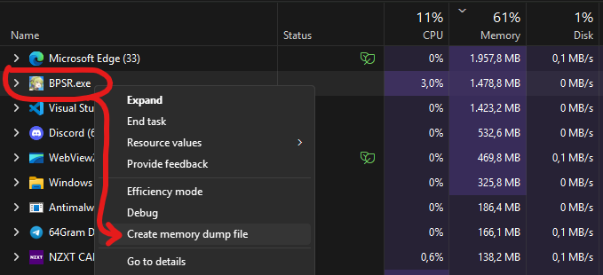

# Star Resonance Dumper

A tool for dumping BPSR `global-metadata.dat` from memory dump files. Supports both existing dump files and automatic process memory dumping.

## Features

- **Works with existing dump files** - Extract metadata from `.dmp` files created via Task Manager or other tools
- **Auto-detection** - Automatically detects and uses `BPSR.exe` or `BPSR_STEAM.exe` when running
- **Process dumping** - Optional Windows process memory dump creation (requires debugging privileges)
- **Smart file handling** - Reuses existing dump files to avoid expensive re-dumping operations
- **Flexible output** - Customizable output file paths (defaults to `./global-metadata.dat`)
- **Verbose logging** - Control logging detail with `-v` and `-vv` flags

## Requirements

- Python 3.9+ (v3.10+ or latest recommended)
- Windows (for process dumping features; existing dump files work on any platform)

## How to Dump Memory

### Option 1: Using Task Manager



The `.DMP` file will be generated in Windows temporary folder (a popup of "Go to file" prompt will be shown). Once generated, move the `.DMP` file to the same directory where `dump_global_metadata.py` exists for easier access.

**Recommended:** Create dump file when the game is logged-in.

### Option 2: Automatic Process Dumping (Windows Only)

The tool can automatically create a memory dump from a running process:

```sh
python dump_global_metadata.py --process BPSR.exe
```

Or let it auto-detect the process:

```sh
python dump_global_metadata.py
```

This will automatically find and dump `BPSR.exe` or `BPSR_STEAM.exe` if running.

## How to Use

### Basic Usage

Extract metadata from an existing dump file:

```sh
python dump_global_metadata.py <dumpfile> <output.dat>
```

### Examples

**Extract from existing dump file:**
```sh
python dump_global_metadata.py BPSR.DMP global-metadata.dat
```

**Auto-detect and dump running process:**
```sh
python dump_global_metadata.py
```

**Specify process explicitly:**
```sh
python dump_global_metadata.py --process BPSR_STEAM.exe
```

**Custom dump file location:**
```sh
python dump_global_metadata.py --process BPSR.exe --dump-out ./my-dump.dmp
```

**Delete dump file after extraction:**
```sh
python dump_global_metadata.py --process BPSR.exe --delete-dump
```

**Verbose logging:**
```sh
python dump_global_metadata.py BPSR.DMP global-metadata.dat -v
```

**All options:**
```sh
python dump_global_metadata.py --process BPSR.exe --dump-out ./dump.dmp --delete-dump -vv
```

### Command-Line Options

- `dumpfile` (optional) - Path to an existing `.dmp` file. If omitted, `--process` is required or auto-detection will be used.
- `outfile` (optional) - Output metadata path (default: `./global-metadata.dat`)
- `--process`, `-p` - Process image name to dump (e.g. `BPSR.exe`). Requires Windows and debugging privileges.
- `--dump-out`, `-d` - Custom dump file path when using `--process`. Defaults to `./<process>.dmp`.
- `--delete-dump` - Delete the dump file after successful extraction (default: keep it)
- `-v`, `--verbose` - Increase logging verbosity. Use `-v` for INFO level, `-vv` for DEBUG level.

## Special Thanks

- [@dmlgzs](https://github.com/dmlgzs) - Analysis and information
- [@rushkii](https://github.com/rushkii) - Original implementation
- [@JordieB](https://github.com/JordieB) - Refactoring and additional features
